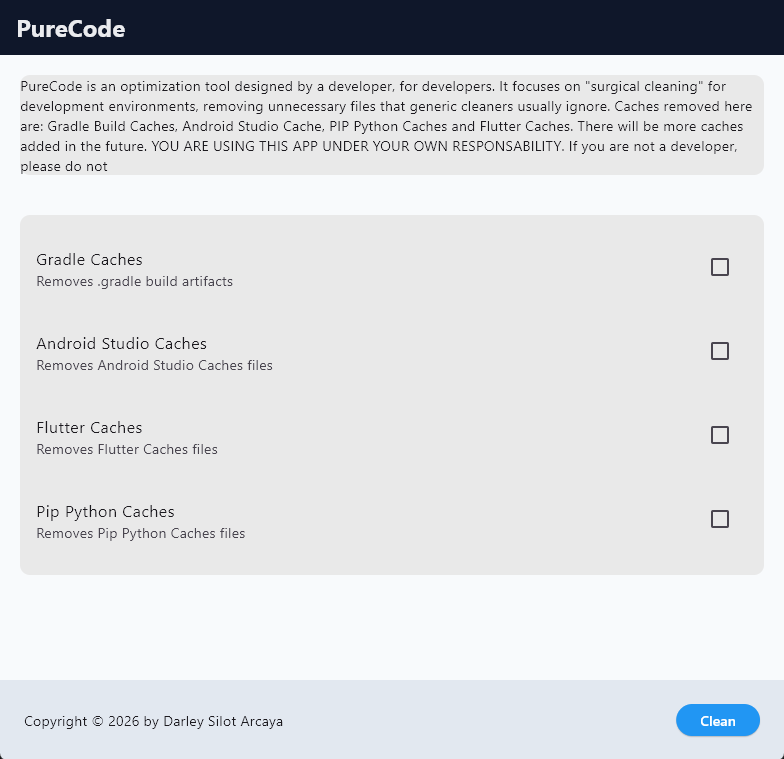

# PureCode 🧹

<p align="center">
  <strong>A surgical, modular optimization tool built by developers, for developers.</strong>
</p>

<p align="center">
  
  
  
  
</p>

---

## 🔍 Preview

<p align="center">
  
</p>

---

## 💡 Why PureCode?

Unlike generic system cleaners, **PureCode** is built with a **modular philosophy**. It target-cleans complex development environments without touching your personal files, ensuring safely optimized workstations.

### ⚡ Advantages of Modular Architecture
* 🎛️ **Total Control:** Each independent cleaning process (Gradle, Android Studio, PIP) lives in its own isolated module.
* 🚀 **Scalability:** Adding support for a new dev tool is as simple as dropping a new file inside the `core/` folder.
* 🛡️ **Fail-Safe Design:** If an IDE or process locks a specific folder, only that module skips gracefully, allowing the rest of the ecosystem to finish the job.

---

## 🛠️ Tech Stack

| Layer | Technology | Key Libraries / Engines |
| :--- | :--- | :--- |
| **Backend** | `FastAPI (Python 3.x)` | `os`, `stat`, `shutil` (Safe system IO) |
| **Frontend** | `Flutter (Dart)` | `http`, asynchronous UI states |

---

## 🔮 Upcoming Features

> 🚀 **Roadmap Update:** A standalone **Windows Executable (`.exe`)** version is currently under development. This will allow users to launch PureCode as a lightweight desktop application with a single click—no Python, Flutter, or terminal setups required.

---

## 📁 Project Structure

```text
PureCode/
├── Source/
│   ├── api/                 # Backend (FastAPI Core)
│   │   ├── core/            # Specialized cleaning modules (.py)
│   │   ├── tests/           # Unit tests & validation scripts
│   │   └── main.py          # API gateway & Endpoints
│   └── client/              # Frontend (Flutter Cross-Platform)
│       ├── lib/             # Main Dart source code
│       ├── windows/         # Windows native build files
│       ├── macos/           # macOS native build files
│       └── pubspec.yaml     # Client dependencies & assets
├── screenshots/             # UI Visual Assets
├── .gitignore               # Root ignore settings
└── README.md                # Documentation
```

## Run Backend Server

``` bash
cd Source/api
uvicorn main:app --reload

```
```text
Access the interactive documentation at: http://127.0.0.1:8000/docs