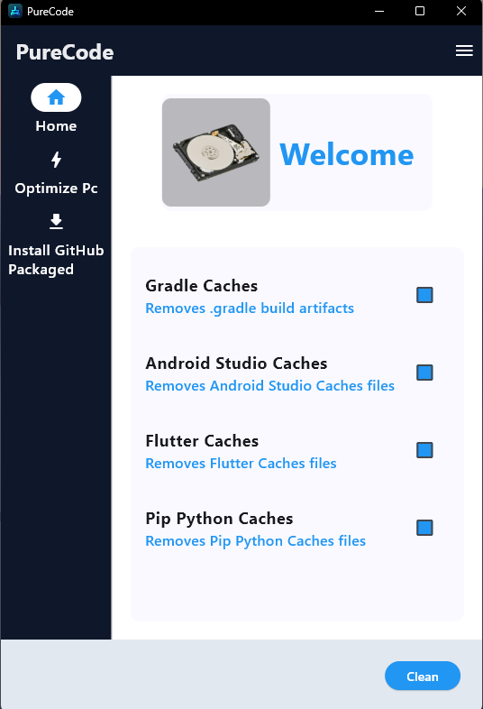
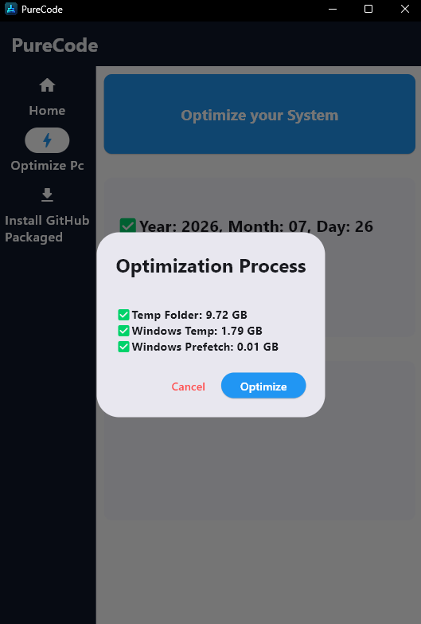
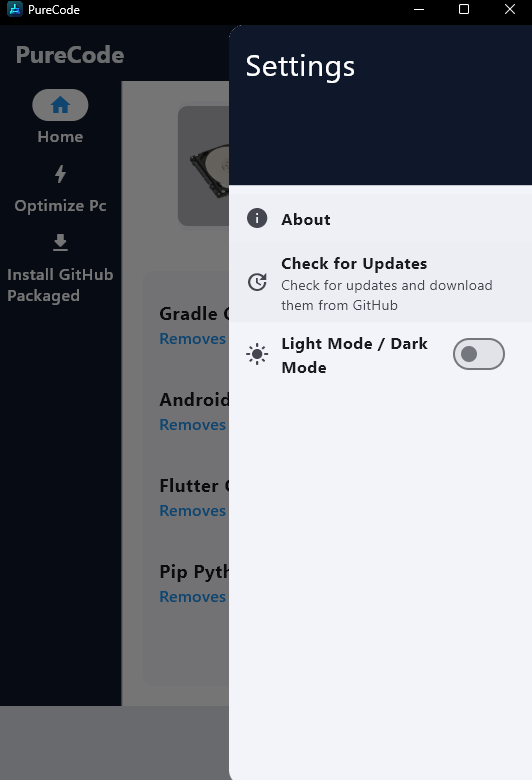

# PureCode 🧹

<p align="center">
  <strong>A surgical, modular optimization tool built by developers, for developers.</strong>
</p>

<p align="center">
  
  
  
  
</p>

---

## 📥 Downloads (Beta)

You can now try **PureCode** without needing to set up development environments!

| Platform | Status | Download Link |
| :--- | :--- | :--- |
| **Windows** | ✅ Stable Beta | [**Download**](https://github.com/DarleyArcaya/PureCode/releases/download/v0.9.0-beta/PureCode_V_0.9.0_Setup.exe) |
| **macOS** | 🏗️ In Progress | *Coming soon* |

---

## 🔍 Preview


<p align="center">
  <table align="center" style="border: none;">
    <tr>
      <td align="center" style="padding: 8px; border: none;">
        
      </td>
      <td align="center" style="padding: 8px; border: none;">
        
      </td>
      <td align="center" style="padding: 8px; border: none;">
        
      </td>
    </tr>
  </table>
</p>
---

## 💡 Why PureCode?

You know the drill: Gradle caches ballooning to 8GB, three Android SDK versions you haven't touched in months, Flutter artifacts from projects you barely remember. Every developer hits this wall eventually.

Yes, you could write a bash script. But **PureCode** gives you modularity, a visual interface, graceful error handling per tool, and a single entrypoint that scales as your stack grows.

Unlike generic system cleaners, **PureCode** is built by developers, for developers — it target-cleans complex development environments without touching your personal files, ensuring a safely optimized workstation every time.

### ⚡ Advantages of Modular Architecture
* 🎛️ **Total Control:** Each cleaning process (Gradle, Android Studio, PIP) lives in its own isolated module — run one or run all, you decide.
* 🚀 **Scalability:** Adding support for a new dev tool is as simple as dropping a new file inside the `core/` folder.
* 🛡️ **Fail-Safe Design:** If an IDE or process locks a specific folder, only that module skips gracefully — the rest of the cleanup finishes without interruption.

---

## 🛠️ Tech Stack

| Layer | Technology | Key Libraries / Engines |
| :--- | :--- | :--- |
| **Backend** | `FastAPI (Python 3.x)` | `os`, `stat`, `shutil` (Safe system IO) |
| **Frontend** | `Flutter (Dart)` | `http`, asynchronous UI states |

---

## 🔮 Upcoming Features

> 🚀 **Roadmap Update:** The **Windows Executable (`.exe`)** is now live! We are currently working on the **MacOS Executable (`.app`)** version. This will allow Mac users to launch PureCode as a lightweight desktop application with a single click—no Python, Flutter, or terminal setups required.

---

## 📁 Project Structure

```text
PureCode/
├── api/                    # Backend (FastAPI Core)
│   ├── core/               # Specialized cleaning modules
│   ├── playground/         # Sandbox for testing new modules
│   ├── tests/              # Unit tests & validation
│   ├── updates/            # Version update logic
│   ├── __pycache__/        # Compiled Python files
│   ├── conftest.py         # Pytest configuration
│   ├── info.txt            # Project info notes
│   └── main.py             # API gateway & Endpoints
├── client/                 # Frontend (Flutter Cross-Platform)
│   ├── assets/             # Images, fonts, backend binary
│   ├── android/            # Android build files
│   ├── ios/                # iOS build files
│   ├── linux/              # Linux build files
│   ├── macos/              # macOS build files
│   ├── web/                # Web build files
│   ├── windows/            # Windows build files
│   ├── lib/                # Main Dart source code
│   ├── .dart_tool/         # Dart tooling folder
│   └── pubspec.yaml        # Client dependencies
├── screenshots/            # UI Visual Assets
├── .gitignore              # Root ignore settings
└── README.md               # Documentation
```

## Run Backend Server

``` bash
cd Source/api
uvicorn main:app --reload

```
```text
Access the interactive documentation at: http://127.0.0.1:8000/docs